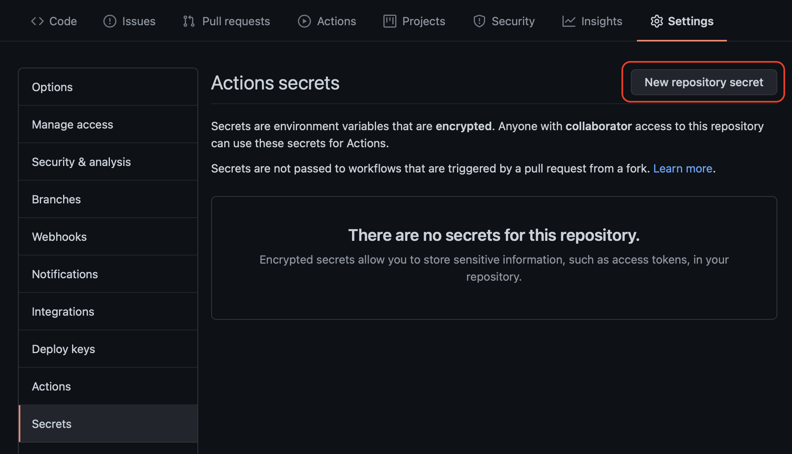
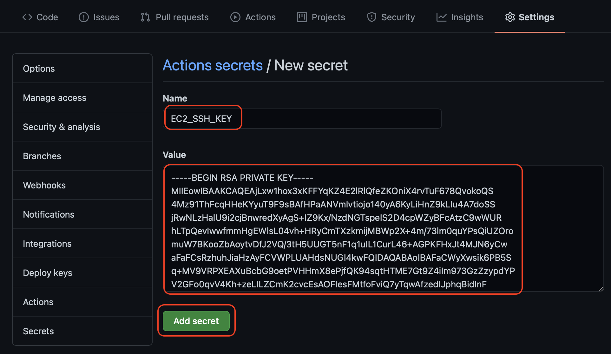

# Deploy to server from GitHub repository
Automatically update a dedicated server on every push to GitHub repository
---

## Introduction

The method described here configures a GitHub repository to deploy updates to a dedicated server (an AWS EC2 instance, or any dedicated server that accepts ssh login) upon a repository push.

The samp code is a NodeJS Express app that simply prints "Hello World". The example server is an AWS EC2 instance configured to run NodeJS, and it may be accessed from a browser at this URL:

[http://54.187.135.188:3000](http://54.187.135.188:3000)

### Auto-restart option with PM2

Some servers (including EC2) do not restart apps when a change is made. Therefore, this example includes [PM2](https://pm2.keymetrics.io), which may be used as an option to restart the app on the server when an update is detected, or whenever the server is rebooted.

## Prerequisites

To enable file transfer from GitHub to the server, the following items are needed:

* server's public dns name (ex. ec2-54-187-135-188.us-west-2.compute.amazonaws.com)
* server's login username (ex. ec2-user)
* EC2_SSH_KEY - server's private key (PEM format)
* server's target directory (ex. /home/ec2-user)

---

### Step 1: Add `EC2_SSH_KEY` to GitHub repository "Secrets"

Open the repository in a browser, navigate to **Settings > Secrets**, and click "New repository secret":



Enter Name: *EC2_SSH_KEY*, Value: (server's private key), then click "Add secret":



### Step 2: Edit the *pushtoec2.yml* file

The file *.github/workflows/pushtoec2.yml* specifies the GitHub Actions that perform the deploy to the server.

The last few lines of *pushtoec2.yml*:
```yaml
          #
          # Edit below to match your server
          REMOTE_HOST: "ec2-54-187-135-188.us-west-2.compute.amazonaws.com"
          REMOTE_USER: "ec2-user"
          TARGET: "/home/ec2-user/demo"
```
Edit the values of `REMOTE_HOST`, `REMOTE_USER`, and `TARGET` to match your server.

* REMOTE_HOST: the server's public DNS name
* REMOTE_USER: the server's login user name
* TARGET: the directory on the server to receive the files
