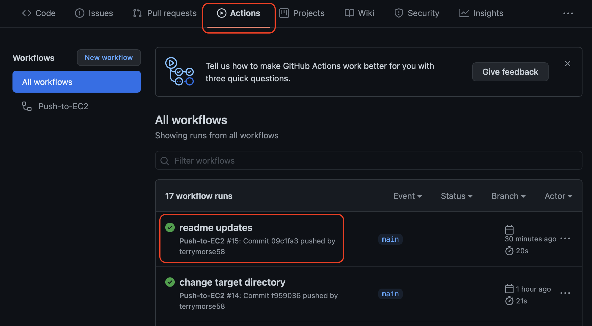
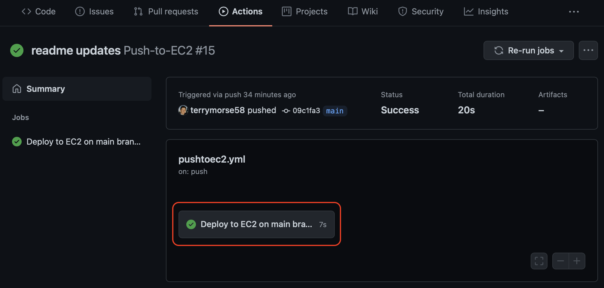
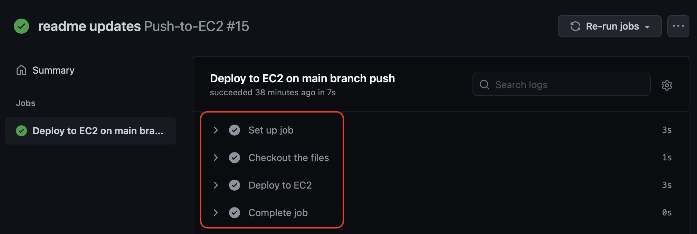

# Deploy to server from GitHub repository
Automatically update a dedicated server on every push to GitHub repository
---

## Introduction

This is a demonstration of how to configure a GitHub repository to deploy updates to a server (ex. an AWS EC2 instance, or any server that accepts ssh login) upon a repository push.

The example code deployed is a NodeJS Express app that simply prints "Hello World". The example server is an AWS EC2 instance configured to run NodeJS, and it may be accessed from a browser at this URL:

[http://54.187.135.188:3000](http://54.187.135.188:3000)

### Auto-restart option with PM2

Some servers (including EC2) do not restart apps when the source code is changed. Therefore, this example includes [PM2](https://pm2.keymetrics.io), which may be used as an option to restart the app on the server when an update is detected, or whenever the server is rebooted.

## Prerequisites

To enable file transfer from GitHub to a server, the following server data are needed:

* server's public dns name (ex. ec2-54-187-135-188.us-west-2.compute.amazonaws.com)
* server's login username (ex. ec2-user)
* EC2_SSH_KEY - server's private key (PEM format)
* server's target directory (ex. /home/ec2-user)

---

### Step 1: Add `EC2_SSH_KEY` to GitHub repository "Secrets"

The server's private key must be stored in the GitHub repository as an [encrypted secret](https://docs.github.com/en/actions/reference/encrypted-secrets). Open the repository in a browser, navigate to **Settings > Secrets**, then click **New repository secret**:


Enter Name: *EC2_SSH_KEY*, Value: (your server's private key), then click **Add secret**:


### Step 2: Edit the *pushtoec2.yml* file

The file *.github/workflows/pushtoec2.yml* control the GitHub Actions that perform the deployment to the server.

*.github/workflows/pushtoec2.yml*:
```yaml
name: Push-to-EC2

# Trigger deployment only on push to main branch
on:
  push:
    branches:
      - main

jobs:
  deploy:
    name: Deploy to EC2 on main branch push
    runs-on: ubuntu-latest

    steps:
      - name: Checkout the files
        uses: actions/checkout@v1

      - name: Deploy to EC2
        uses: easingthemes/ssh-deploy@v2.1.5
        env:
          SSH_PRIVATE_KEY: ${{ secrets.EC2_SSH_KEY }}
          #
          # Edit below to match your server
          REMOTE_HOST: "ec2-54-187-135-188.us-west-2.compute.amazonaws.com"
          REMOTE_USER: "ec2-user"
          TARGET: "/home/ec2-user/demo"
```
Edit the values of `REMOTE_HOST`, `REMOTE_USER`, and `TARGET` to match your server.

* REMOTE_HOST: the server's public DNS name
* REMOTE_USER: the server's login user name
* TARGET: the server path to receive the files

GitHub Actions will now deploy to the server whenever *main* branch is updated.

---

## Review deployment results

To monitor the result or progress of a deployment, click on the *Actions* tab, then click the git commit you are interested in. The example below selects the git commit "readme updates":



This will display the summary of the GitHub actions for this git commit (below). To see further details, click on the job shown:



This will display the job details:


